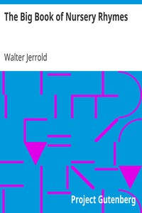

My Favorite Free eBook
======================

This project is meant to showcase my ability to use Markdown to create a Website in the GitHub environment.

Data Source
-------------------

 The Big Book of Nursery Rhymes (https://www.gutenberg.org/ebooks/38562) 

Items of Interest
-----------------

*Chapters
*Pages

Proposed Layout
---------------

